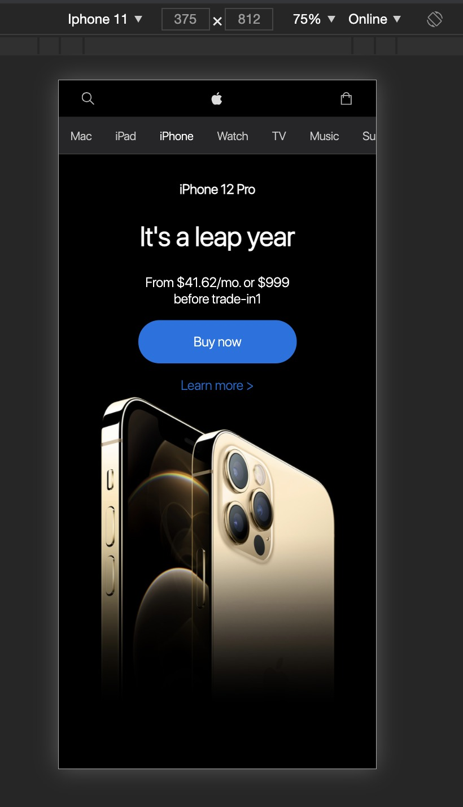

# Procesverslag
**Auteur:** Rachid el Ouali

Markdown cheat cheet: [Hulp bij het schrijven van Markdown](https://github.com/adam-p/markdown-here/wiki/Markdown-Cheatsheet). Nb. de standaardstructuur en de spartaanse opmaak zijn helemaal prima. Het gaat om de inhoud van je procesverslag. Besteedt de tijd voor pracht en praal aan je website.

25/11/2020 Voortgang 1 (week 3)
Vandaag heb ik de header en de eerste sectie van mijn pagina gemaakt. Ik heb deze website op iPhone 11 formaat gemaakt.

De navigatie menu anders gedaan dan op de Apple website, omdat ik vind 
dat een hamburger menu de discoverability verminderd. De pagina ziet er nu als volgt uit:

Na mijn werk gedeeld te hebben met mijn groep heb ik veel feedback gekregen om code netter te schrijven en daarnaast problemen op te lossen. 
Deze feedback zal ik gaan verwerken. 

10/11/2020 (week 1)
Ik heb besloten de productpagina na te maken in plaats van de Home pagina. Deze keuze heb ik gemaakt, omdat 
het mij uitdagender lijkt om de productenpagina (detailpagina) na te maken. Ik ga dus de iPhone promotie pagina maken en de detailpagina.

11/11/2020 (week 1)
Ik heb een breakdownschets gemaakt om de elementen van de pagina's die ik na ga maken in kaart te brengen en ik vind dit ook een goede manier om mijn 
HTML skills weer op te frissen. Dit het is het resultaat:

## Bronnenlijst
1. -bron 1-
2. -bron 2-
3. -...-

## Eindgesprek (week 7/8)

-dit ging goed & dit was lastig-

**Screenshot(s):**

-screenshot(s) van je eindresultaat-

## Voortgang 3 (week 6)

-same as voortgang 1-

## Voortgang 2 (week 5)

-same as voortgang 1-

## Voortgang 1 (week 3)

### Stand van zaken

-dit ging goed & dit was lastig-

**Screenshot(s):**

-screenshot(s) van hoe ver je bent met korte uitleg-

### Agenda voor meeting

-samen met je groepje opstellen-

| student 1      | student 2          | student 3    | student 4        |
| ---            | ---                | ---          | ---              |
| dit bespreken  | en dit             | en ik dit    | en dan ik dat    |
| an dat ook nog | dit als er tijd is | nog een punt | dit wil ik zeker |
| ...            | ...                | ...          | ...              |

### Verslag van meeting

-na afloop snel uitkomsten vastleggen-

## Breakdownschets (week 1)

-uitwerken voor de 1e werkgroep - eind van de eerste week-

## Intake (week 1)
-uitwerken voor de kick-off werkgroep - begin van de eerste week-

**Je startniveau:** -kies uit zwart, rood óf blauw-

Rood

**Je focus:** -kies uit responsive óf surface plane-

Beide

**Je opdracht:** -link naar de website die je gaat namaken óf de naam van je eigen ontwerp-

apple.com

**Screenshot(s) van de eerste pagina (small screen):**

**Screenshot(s) van de tweede pagina (small screen):**

