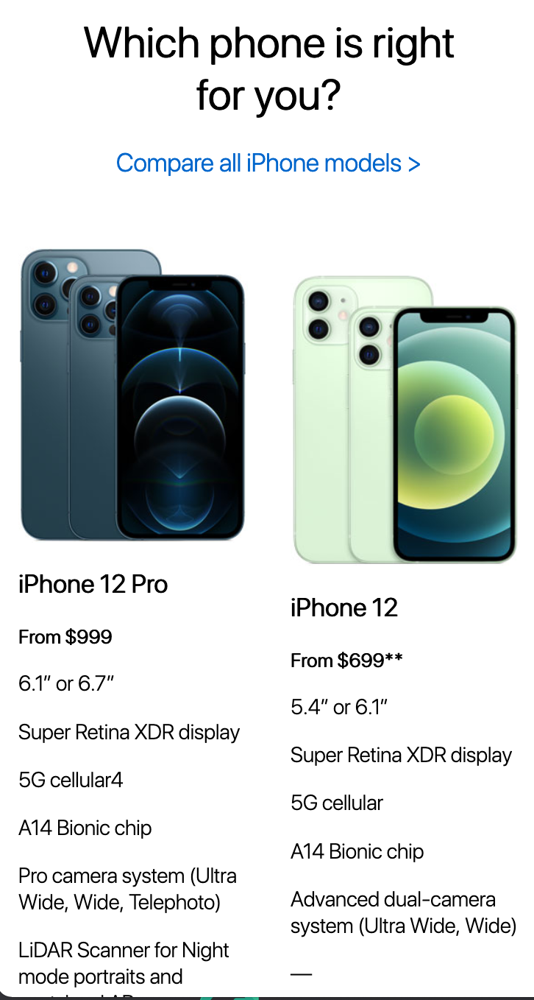
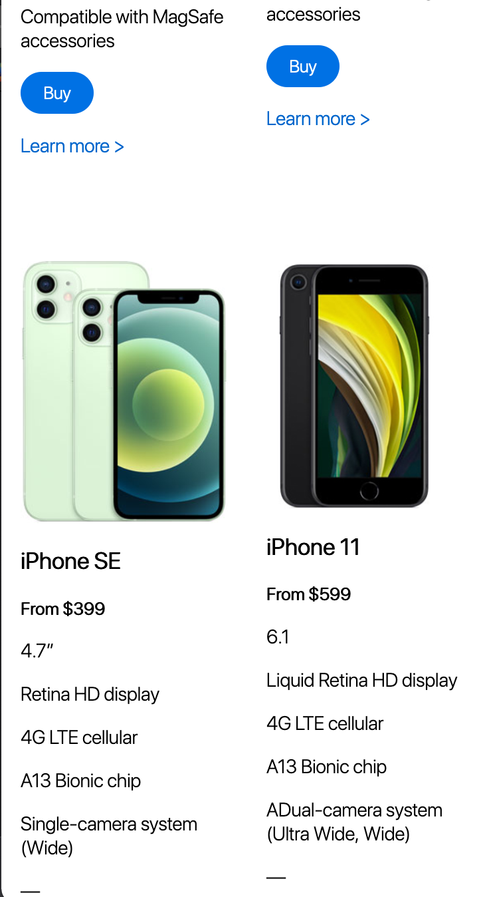
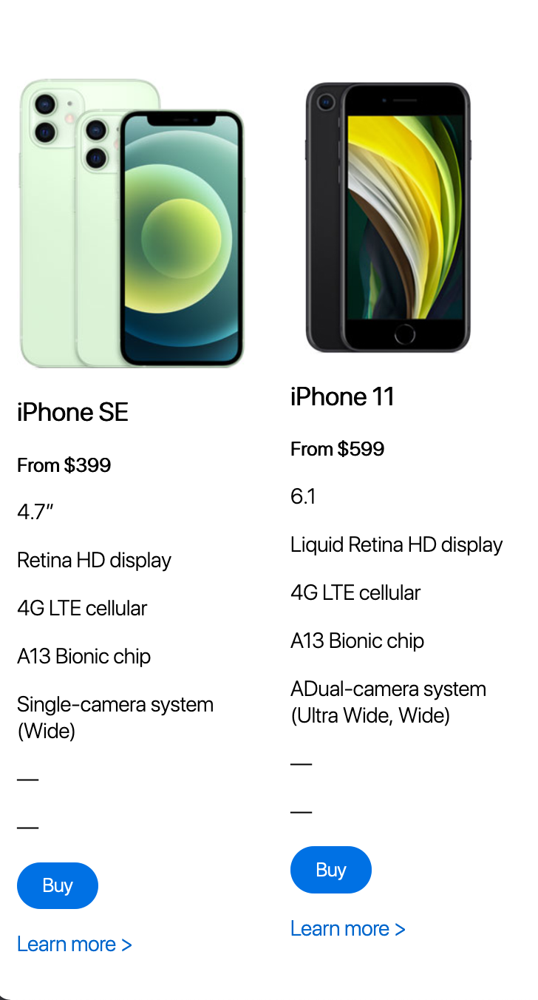
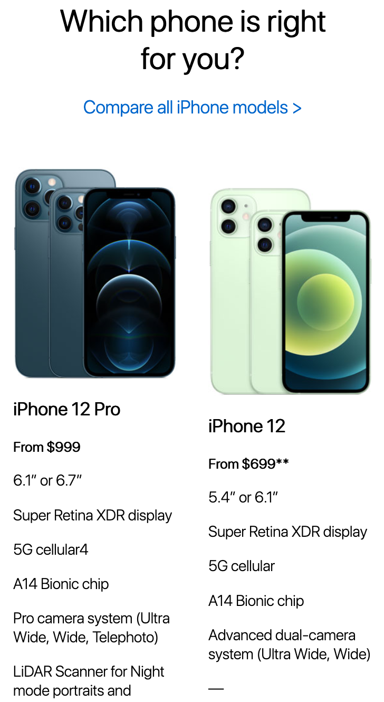
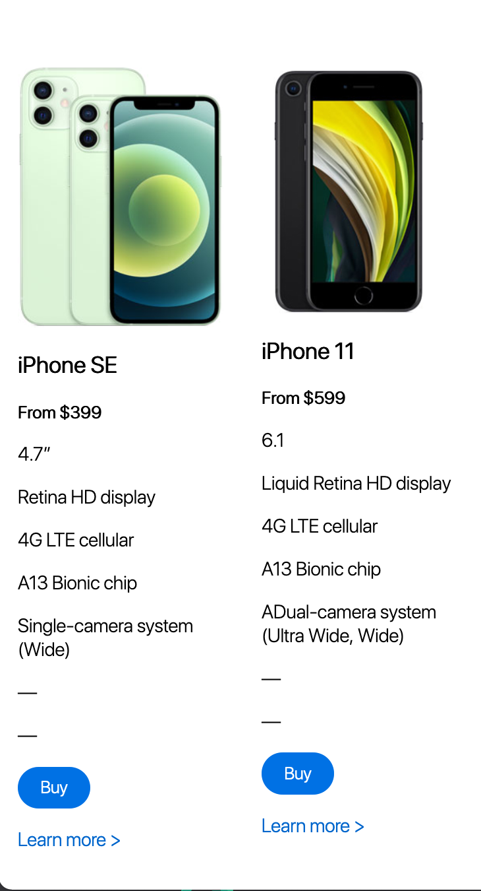
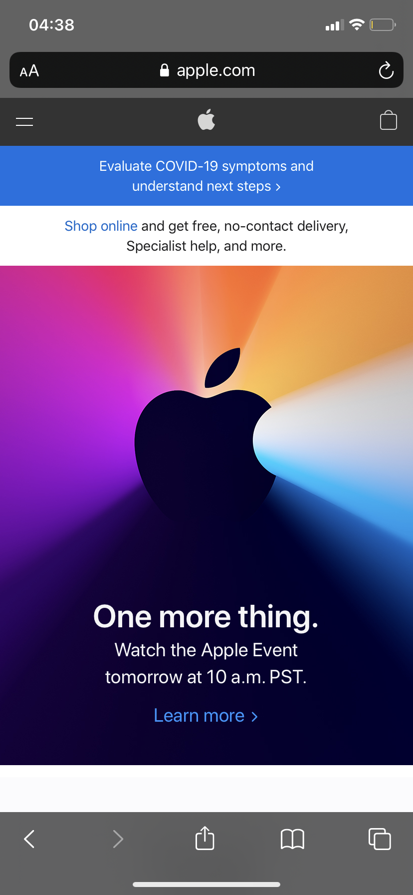
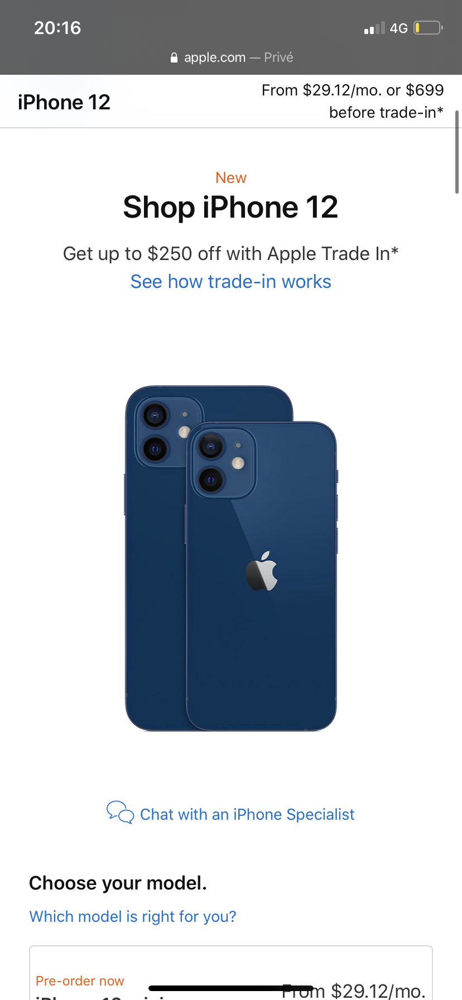

# Procesverslag
**Auteur:** Rachid el Ouali

Markdown cheat cheet: [Hulp bij het schrijven van Markdown](https://github.com/adam-p/markdown-here/wiki/Markdown-Cheatsheet). Nb. de standaardstructuur en de spartaanse opmaak zijn helemaal prima. Het gaat om de inhoud van je procesverslag. Besteedt de tijd voor pracht en praal aan je website.

<h1>Inleiding</h1>
Dit verslag schrijf ik om de reflecteren en evalueren over mijn ervaring met het vak FED.

<h1> Reflectie per voortgang <h1>

<h2>Voortgang 1</h2>
In de week van voortgang 1 had ik al meteen het gevoel gekregen dat ik achterloop.
Ik heb de opdrachten onderschat en hierdoor sommige opdrachten niet gemaakt. Hierdoor
heb ik best wel slordige code geschreven voor mijn eindopdracht.

<h2>Voortgang 2</h2>
In de week van voortgang 2 heb ik veel werk ingehaald, maar was ik nog steeds niet helemaal bij.
Ik had deze week wel de product overzicht sectie gemaakt voor mijn eindopdracht. Hier was ik wel
trots op. Doordat ik toch besloten heb werk in te halen, heb ik de product overzicht sectie vrij snel kunnen maken
doordat ik flexbox eindelijk begon te begrijpen.

<h2>Voortgang 3</h2>
In de week van voortgang 3 heb ik niks gedaan voor mijn eindopdracht. Dit is echte zonde, want nu kan ik
geen feedback ontvangen. Door de druk van een 1e jaar vak moest ik prioriteiten stellen. Dit had ook invloed
op mijn vooruitgang binnen FED.

<h2>Eindgesprek</h2>
Ik heb de eindgesprek niet gehad, omdat ik veels te weinig af had. Ik was namelijk niet verder gekomen dan de laatste voortgang.
Ik ga voor de herkansing. Ik heb alleen de 1e pagina gemaakt. De 2e pagina moet ik nog maken.

<h2>Eindoplevering</h2>
Ik heb vanwege tijdsnood de opdracht niet 100% afgekregen hoe ik dit wilde hebben. Ik ben benieuwd naar mijn beoordeling.

<h1>Eindconclusie</h1>
Ik ben tot conclusie gekomen dat ik Front-end development wel kan, maar ik meer tijd hierin moet steken dan de gemiddelde leerling. Ik gebruik
ook veel code dat een beetje oud is en niet meer gebruikt word. Daarnaast moet ik ook beter plannen, zodat ik niet meer alles last-minute inlever. (Het is 4:57 terwijl ik dit schrijf :(). 

# Bronnenlijst
1. https://css-tricks.com/
2. https://www.w3schools.com/
3. https://www.apple.com/iphone/
4. https://www.apple.com/shop/buy-iphone/iphone-12-pro
5. https://stackoverflow.com/
6. https://developer.mozilla.org/
7. https://www.youtube.com/watch?v=tEC4kqzNTnM&t=54s
8. https://www.codingsnow.com/2021/01/responsive-image-slider-with-manual.html

## Eindgesprek (week 7/8)

- Ik moet de opdracht herkansen. Ik heb niet genoeg af. Ik moet
nog flink gaan door werken
 

 
**Screenshot(s):**
 

## Voortgang 3 (week 6)
Deze week heb ik helaas niks afgekregen.

## Voortgang 2 (week 5)
Deze week heb ik de product overzicht toegevoegd aan de iPhone merken pagina. Ik ben trots op dit gedeelte, omdat
ik dit heb gemaakt met flex box. Dit is iets, waarmee ik in het begin van het vak veel mee kampte.
Ik moet nog wel vee leren over flexbox en grid.
 
 

 

 

## Voortgang 1 (week 3)
Ik moet erop letten dat ik geen gebruik maak van classes en code goed reviewen, zodat
ik geen onnodige code heb. De vormgeving lijkt wel heel op die van Apple. Dit ziet
er dus wel goed uit. Ik heb besloten de productpagina na te maken in plaats van de Home pagina. Deze keuze heb ik gemaakt, omdat
het mij uitdagender lijkt om de productenpagina (detailpagina) na te maken. Ik ga dus de iPhone promotie pagina maken en de detailpagina.
 
**Screenshot(s):**
Ik ben deze week niet heel ver gekomen. Ik heb de navigatie toegevoegd en een Heroshot. Ik
heb hierbij alleen nog gebruik gemaakt van HTML/CSS. Nog geen Javascript dus.
 
 

 

### Agenda voor meeting

-samen met je groepje opstellen-

| Wies               | student 2          | student 3    | student 4        |
| ---                | ---                | ---          | ---              |
| Student mijn code  |         |    |  |
  laten zien om
  feedback te
  ontvangen
| ...                 | ...                | ...          | ...              |

### Verslag van meeting
Website begint te lijken op de website van Apple. Mijn code is echter niet netjes.
Ik heb teveel gebruik gemaakt van classes en daarnaast gebruik gemaakt van
codes die "oud" zijn en niet meer handig zijn voor gebruik.

## Breakdownschets (week 1)

## Intake (week 1)

**Je startniveau:** -kies uit zwart, rood óf blauw-

Rood

**Je focus:** -kies uit responsive óf surface plane-

Beide

**Je opdracht:** -link naar de website die je gaat namaken óf de naam van je eigen ontwerp-

apple.com

**Screenshot(s) van de eerste pagina (small screen):**

**Screenshot(s) van de tweede pagina (small screen):**

